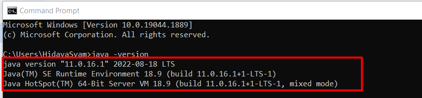

# Java Setup

- ## [Introduction](#Introduction)

- ## [Prerequisites](#Prerequisites)

- ## [Installation](#Installation)

 

## Introduction

### The Java Development Kit (JDK) is software used for Java programming, along with the Java Virtual Machine (JVM) and the Java Runtime Environment (JRE). The JDK includes the compiler and class libraries, allowing developers to create Java programs executable by the JVM and JRE

 

## Prerequisites

1. ### A system running Windows 10

2. ### A network connection

3. ### Administrator privileges

 

## Installation

- ### [Windows](#Windows)

- ### [MacOS]()
> Installation for mac will be available later, but If you have mac OS reach out anyone of the TAs or the Instructor 

## Setup for Windows

### Download Java Development Kit (JDK )installation file for Windows 10

- ### Using your preferred web browser, navigate to [Download Page](https://drive.google.com/drive/folders/1LPf5xHZo5nCAqdwmldAu_J4LzZ-sxVRg?usp=sharing), Then download JDK Windows Version.

 

## After downloading the installation file, proceed with installing Java on your Windows system.

## Follow the steps below:

- ### Step 1: Run the Downloaded File Double-click the downloaded file to start the installation.

- ### Step 2: Configure the Installation Wizard After running the installation file, the installation wizard welcome screen appears.
    1. ### Click Next to proceed to the next step.
        

    2. ### Choose the destination folder for the Java installation files or stick to the default path. Click Next to proceed.
        

    3. ### Wait for the wizard to finish the installation process until the Successfully Installed message appears. Click Close to exit the wizard.
        

## Set Environmental Variables in Java
### Set Java environment variables to enable program compiling from any directory. To do so, follow the steps below:

## Step 1: Add Java to System Variables
1. Open the Start menu and search for environment variables.

2. Select the Edit the system environment variables result.

 

3. In the System Properties window, under the **Advanced tab**, click **Environment Variables…**

 

4. Under the System variables category, select the **Path** variable and click **Edit**:

5. Click the **New** button and enter the path to the Java bin directory

 

6. Click OK to save the changes and exit the variable editing window.

## Step 2: Add JAVA_HOME Variable
Some applications require the **JAVA_HOME** variable. Follow the steps below to create the variable:

1. In the Environment Variables window, under the System variables category, click the **New…** button to create a new variable.
 

2. Name the variable as **JAVA_HOME.**

3. In the variable value field, paste the **path to your Java jdk directory** and click OK.
 

4. Confirm the changes by clicking OK in the Environment Variables and System properties windows.

## Test the Java Installation
Run the **java -version** command in the command prompt to make sure Java installed correctly:

 

## Installing IntelliJ IDEA on Windows
### What is a IntelliJ IDEA?
#### IntelliJ IDEA is an IDE, or Integrated Development Environment, by JetBrains. It attempts to integrate all of the development tools that you might need into one single place.
 

### Step1: Download IntelliJ IDEA using the Jetbrains website or using the [Download link](https://www.jetbrains.com/idea/download/).
**Download the Community edition because it is free as well as open-source edition.** 

### Step2: After downloading, move to the Download location, and start the installer. A security warning may occur. Click on the 'Run' option.
 

### Step3: After the security check, the setup will start loading. A welcome screen will appear. Click next and follow the installer instructions.

### Step4: Choose an appropriate installation location. Click Next.

### Step5: Choose an appropriate desktop shortcut. Also, select the '.java' file. This will associate the java files automatically with IntelliJ IDEA.

Click on the Next button.

### Step6: Choose the start menu folder as 'JetBrains' (by default). Then, click Install.

### Step7: The IntelliJ IDEA will start installing to the system.

### Step8: After installing the setup, click on Next, then Finish.

## In this way, IntelliJ IDEA will get installed to the system.

### Step9: Open the IntelliJ IDEA from its shortcut. A dialog box will open asking to import settings from the previous installation. Select 'Do not import settings' radio button. Click OK. This option is chosen because the user might be installing IntelliJ for the first time.

##  HAPPY INSTALLATION :)

