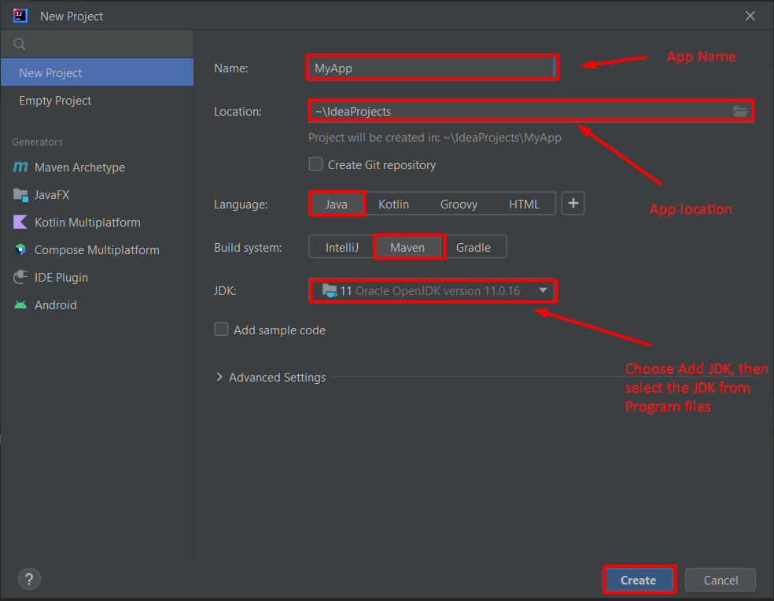

# Java Basic Syntax

## High Level Goals

By the end of this lesson you should be familiar with the following:

* How to write / run simple java program.
* Learn the Basics
* Hello, World!
* Variables and Types
* Conditionals
* Arrays
* Loops
* Functions
* Java Input

## First Java Program

```java
// Hello World Example
class HelloWorld {
    public static void main(String[] args) {
        System.out.println("Hello, World!");
    }
}
```

* Every valid Java Application must have a class definition that matches the filename (class name and file name should
  be same).
* The `main` method must be inside the class definition.
* The compiler executes the codes starting from the main function.


## Variables and Types
Although Java is object oriented, not all types are objects. It is built on top of basic variable types called primitives.

Here is a list of all primitives in Java:

* byte (number, 1 byte)
* short (number, 2 bytes)
* int (number, 4 bytes)
* long (number, 8 bytes)
* float (float number, 4 bytes)
* double (float number, 8 bytes)
* char (a character, 2 bytes)
* boolean (true or false, 1 byte)

> Java is a strong typed language, which means variables need to be defined before we use them.

### Numbers
To declare and assign a number use the following syntax:
```java
int myNumber;
myNumber = 5;
```

Or you can combine them:
```java
int myNumber = 5;
```
To define a double floating point number, use the following syntax:
```java
double d = 4.5;
d = 3.0;
```
If you want to use float, you will have to cast:
```java
float f = (float) 4.5;
```
Or, You can use this:
```java
float f = 4.5f; // (f is a shorter way of casting float)
```

### Characters and Strings
In Java, a character is it's own type and it's not simply a number, so it's not common to put an ascii value in it, there is a special syntax for chars:
```java
char c = 'g';
```
Here are some ways to use a string:
```java
// Create a string with a constructor
String s1 = new String("Who let the dogs out?");  
// Just using "" creates a string, so no need to write it the previous way.
String s2 = "Who who who who!";  
// Java defined the operator + on strings to concatenate:
String s3 = s1 + s2;
```

You can also concat string to Numbers:
```java
int num = 5;
String s = "I have " + num + " cookies"; //Be sure not to use "" with Numbers.
```
### boolean
Every comparison operator in java will return the type boolean. Unlike other languages, it only accepts two special values: true or false.

## Conditionals
Java uses boolean variables to evaluate conditions. The boolean values true and false are returned when an expression is compared or evaluated. For example:
```java
int a = 4;

if (a == 4) {
    System.out.println("It's true!");
}

```

### Boolean operators
There aren't that many operators to use in conditional statements and most of them are pretty straight forward:
```java
int num1 = 4;
int num2 = 5;
boolean result;
result = num1 < num2; // true
result = num1 > num2; // false
result = num1 <= 4; // num1 smaller or equal to 4 - true
result = num2 >= 6; // num2 bigger or equal to 6 - false
result = num1 == num2; // num1 equal to num2 - false
result = num1 != num2; // num1 is not equal to num2 - true
result = num1 > num2 || num1 < num2; // Logical or - true
result = 3 < num1 && num1 < 6; // Logical and - true
result = !result; // Logical not - false
```

### if - else and between

we can also add an else statement after an if, to do something if the condition is not true
```java
int num1 = 4;
int num2 = 5;
if (num1 == num2) {
    // We already know this part
} else {
    // num1a and num2 are not equal... :/
}
```

> There is a another way to write a one line if - else statement by using the operator ? :
```java
int num1 = 4;
int result = num1 == 4 ? 1 : 8;

// result will be 1
// This is equivalent to
int result;

if (num1 == 4) {
    result = 1;
} else {
    result = 8;
}
```

### Java switch statement

```java
  int number = 44;
        String size;

        // switch statement to check size
        switch (number) {

            case 29:
                size = "Small";
                break;

            case 42:
                size = "Medium";
                break;

            // match the value of week
            case 44:
                size = "Large";
                break;

            case 48:
                size = "Extra Large";
                break;

            default:
                size = "Unknown";
                break;

        }
        System.out.println("Size: " + size);

```


### == and equals

The operator == works a bit different on objects than on primitives. When we are using objects and want to check if they are equal, the operator == will say if they are the same, if you want to check if they are logically equal, you should use the equals method on the object. For example:
```java
String a = new String("Wow");
String b = new String("Wow");
String sameA = a;

boolean r1 = a == b;      // This is false, since a and b are not the same object
boolean r2 = a.equals(b); // This is true, since a and b are logically equals
boolean r3 = a == sameA;  // This is true, since a and sameA are really the same object
```

## Arrays
Arrays in Java are also objects. They need to be declared and then created. In order to declare a variable that will hold an array of integers, we use the following syntax:
```java
int[] arr;
```
Notice there is no size, since we didn't create the array yet.
```java
arr = new int[10];
```
This will create a new array with the size of 10. We can check the size by printing the array's length:
```java
System.out.println(arr.length);
```
We can access the array and set values:
```java
arr[0] = 4;
arr[1] = arr[0] + 5;
```
Java arrays are 0 based, which means the first element in an array is accessed at index 0 (e.g: arr[0], which accesses the first element). Also, as an example, an array of size 5 will only go up to index 4 due to it being 0 based.
```java
int[] arr = new int[5];
//accesses and sets the first element
arr[0] = 4;
```
We can also create an array with values in the same line:
```java
int[] arr = {1, 2, 3, 4, 5};
```
Don't try to print the array without a loop, it will print something nasty like [I@f7e6a96. To print out an array, use the following code:
```java
for (int i=0; i < arr.length; i++) {
    System.out.println(arr[i]);
}
```

A multidimensional array is an array of arrays. Each element of a multidimensional array is an array itself.

```java
class MultidimensionalArray {
    public static void main(String[] args) {

        // create a 2d array
        int[][] a = {
                {1, -2, 3},
                {-4, -5, 6, 9},
                {7},
        };

        // first for...each loop access the individual array
        // inside the 2d array
        for (int[] innerArray : a) {
            // second for...each loop access each element inside the row
            for (int data : innerArray) {
                System.out.println(data);
            }
        }
    }
}
```

### Java ArrayList
The ArrayList class is a resizable array, which can be found in the java.util package.

The difference between a built-in array and an ArrayList in Java, is that the size of an array cannot be modified (if you want to add or remove elements to/from an array, you have to create a new one). While elements can be added and removed from an ArrayList whenever you want. The syntax is also slightly different:
```java
import java.util.ArrayList; // import the ArrayList class

ArrayList<String> names = new ArrayList<String>(); // Create an ArrayList object

//Add Items
    names.add("Mohammed");
    names.add("Ahmed");
    names.add("Ali");
    names.add("Khalid");
    System.out.println(names)

    //Access an Item
    System.out.println(names.get(0);

    //Remove an Item
    // remove element at index 2
    int removedElement = names.remove(2);

    System.out.println("Removed Element: " + removedElement);

)

```

## Loops
There are two kind of loops in Java, for and while.

### For
```java
for (int i = 0; i < 3; i++) {}
```

### While
The syntax is very similar to the previous for we looked at:
```java
while (condition) {}
```

### Do-While
If we want the loop to always run at least one, we can use do-while
```java
do {

} while(condition);
```
> Notice the ; in the end of the do-while.

### Foreach
Another version of for, is the foreach. The keyword we use is still for, but when we want to iterate on the elements inside an array we can simply use it:
```java
int[] arr = {2, 0, 1, 3};
for (int el : arr) {
    System.out.println(el);
}
```

### break and continue
These two keywords help us control the loop from within it. break will cause the loop to stop and will go immediately to the next statement after the loop:
```java
int i;
for (i = 0; i < 5; i++) {
    if (i >= 2) {
        break;
    }
    System.out.println("WOW!");
}
System.out.println(i);
// Output:
// WOW!
// WOW!
// 2
```
continue will stop the current iteration and will move to the next one. Notice that inside a for loop, it will still run the third section.
```java
int i;
for (i = 0; i < 5; i++) {
    if (i >= 3) {
        break;
    }
    System.out.println("WOW!");
    if (i >= 1) {
        continue;
    }
    System.out.println("MOMO");
}
System.out.println(i);
// Output
// WOW!
// MOMO
// WOW!
// WOW!
// 3
```

## Functions
In Java, all function definitions must be inside classes. We also call functions methods. Let's look at an example method
```java
public class App {
    public static void foo() {
        // Do something here
    }
}
```
foo is a method we defined in class App. Notice a few things about foo.

* **static** means this method belongs to the class App and not to a specific instance of App. Which means we can call the method from a different class like that App.foo().

* **void** means this method doesn't return a value. Methods can return a single value in Java and it has to be defined in the method declaration. However, you can use return by itself to exit the method.
* This method doesn't get any arguments, but of course Java methods can get arguments as we'll see further on.

### Arguments
I always like to say that arguments to Java methods are passed by value, although some might disagree with my choice of words, I find it the best way to explain and understand how it works exactly.

By value means that arguments are copied when the method runs. Let's look at an example.
```java
public void foo(int num1, int num2) {
    ...
}
```
Calling foo
```java
int a = 3;
int b = 5;
bar(a, b);
```

### Another Example:
This is Sum method takes 2 arguments and return Integer value represent the summation of the 2 arguments
```java
public int sum(int num1, int num2) {
    return num1 + num2;
}
```
Calling sum
```java
int num1 = 31;
int num2 = 5;
int result = sum(num1, num2);
int result2 = sum(10, 2);
```


## Java Input

You can get input in java in different ways. In this section we are going to use `Scanner` object to get user input.

```java
import java.util.Scanner;

class Input {

    public static void main(String[] args) {
        Scanner input = new Scanner(System.in);
        System.out.print("Enter an Integer: ");
        int number = input.nextInt();
        System.out.println("Your number is: " + number);

        // close the scanner input
        input.close();
    }
}
```
### [Installation Instructions](./Installation.md)
<br/>

### Create First Java Project



### Practice

1. Write a Java Function to print the result of the following operations.
    - -5 + 8 * 6
    - (55+9) % 9
    - 20 + -3*5 / 8
    - d. 5 + 15 / 3 * 2 - 8 % 3
    - Expected Output :
        - 43
        - 1
        - 19
        - 13


2. Write java function `endsWith` that accept two string arguments, string and char, and returns true if the string ends with that character.

* case 1:
  - endsWith("Hello", 'o');
  - Expected Output: true
* case 2:
  - endsWith("Hello", 'O');
  - Expected Output: true
* case 1:
  - endsWith("World", 'h');
  - Expected Output: false
* case 2:
  - endsWith("World", 'a')
  - Expected Output: false

3. Write a Java Function and compute the sum of the digits of an integer.
    - Input an integer: 25
    - Expected Output: `The sum of the digits is: 7`

4. Write a Java Function to reverse a string.
    - Input a string: The quick brown fox
    - Expected Output: `Reverse string: xof nworb kciuq ehT`

5. Write java function `guessTheSquareRoot` that accepts two int arguments, number and squareRoot, and returns a string "correct" if the guess is correct or return "incorrect" if the guess is incorrect.

- case 1:
  - guessTheSquareRoot(4, 2);
  - Expected Output: "correct"
- case 2:
  - uessTheSquareRoot(4, 3);
  - Expected Output: "incorrect"

6. Write a Java function `evenAndOdd` to count the number of even and odd elements in a given array of integers.
    - Input: evenAndOdd(new int [] {5, 7, 2, 4, 9})
    - Expected Output:
        - Number of even elements in the array: 2
        - Number of odd elements in the array: 3

7. Write a Java Function to `multiply` corresponding elements of two arrays of integers.
    - Input: multiply(new int [] { 1, 3, -5, 4},new int []{1, 4, -5, -2})
    - Expected Output: [1 ,12, 25, -8] 

8. Write a Java function called **reverseArray** which takes an array as an argument. Without utilizing any of the built-in methods available to your language, return an array with elements in reversed order.
    - Input: reverseArray(new int []{1, 2, 3, 4, 5, 6})
    - Expected Output:[6, 5, 4, 3, 2, 1]


9. Write a Java function **containsDuplicates** that takes an array of String as an argument and returns true or false depending on whether the array contains duplicate values.
* case 1:
    - Input: containsDuplicates(new String[]{"Ali" , "MOMO", "Salma", "Ali"})
    - Expected Output: true
* case 2:
     - Input: containsDuplicates(new String[]{"Nada" , "MOMO", "Salma", "Ali"})
     - Expected Output: false


10. Write a Java function **removeDuplicates** that takes an ArrayList of String as an argument and returns  a new ArrayList of strings without duplicate values.
* case 1:
    - Input: removeDuplicates(new String[]{"Ali" , "MOMO", "Salma", "Ali"})
    - Expected Output: ["MOMO", "Salma", "Ali"]
* case 2:
     - Input: removeDuplicates(new String[]{"Nada" , "MOMO", "Salma", "Ali"})
     - Expected Output:["Nada" , "MOMO", "Salma", "Ali"]

11. Write a Java function **removeElement** that takes an array of Numbers and Integer element as an argument and remove the element from the array then returns  a new array of Numbers without the element.

* case 1:
    - Input: removeElement(new int []{1,5,11,3,7},11)
    - Expected Output: [1,5,3,7]
* case 2:
    - Input: removeElement(new int []{1,5,11,3,4,7,9,13},13)
    - Expected Output: [1,5,11,3,4,7,9]
* case 3:
    - Input: removeElement(new int []{1,5,11,3,4,7,9,13},15)
    - Expected Output: [1,5,11,3,4,7,9,13]
* case 4:
    - Input: removeElement(new int {11,5,11,3,4,7,9,13},11)
    - Expected Output: [5,11,3,4,7,9,13]
* case 5:
    - Input: removeElement(new int []{4},4)
    - Expected Output: []


12. Write a Java function called **insertShiftArray** which takes in an array and a value to be added. Without utilizing any of the built-in methods available to your language, return an array with the new value added at the middle index.

* case 1:
    - Input: insertShiftArray(new int []{2,4,6,-8}, 5)
    - Expected Output: [2,4,5,6,-8]
* case 2:
    - Input: insertShiftArray(new int []{42,8,15,23,42}, 16)
    - Expected Output: [42,8,15,16,23,42]


13. Write a Java function range that accepts two Integer numbers  as an argument and returns a ArrayList of all the numbers in between the two values in an acceding order, start and end are included and if only one value is provided then consider that the other value is zero.

* case 1:
    - Input:range(5, 8);
    - Expected Output: [5, 6, 7, 8]
* case 1:
    - Input:range(8, 5);;
    - Expected Output: [5, 6, 7, 8]


14. Write a Java function sort that accepts an unordered array of numbers and returns the same array in a descending order. Do NOT use the built-in method sort.

* case 1:
    - Input: sort(new int []{0, 1, 2, 3, 4, 5, 6});
    - Expected Output: [6, 5, 4, 3, 2, 1, 0]
* case 2:
    - Input: sort(new int []{3, 6, 2, 0, 4, 1, 5}); 
    - Expected Output: [6, 5, 4, 3, 2, 1, 0]

15. Write a java function called **zipLists** that takes 2 arrays as an arguments then return New array zipped as noted below Zip the two Lists together into one so that the elements alternate between the two lists and return a zipped list.

* case 1:
    - Input: zipLists(new int []{1, 3, 2},new int []{5, 9, 4});
    - Expected Output: [1, 5, 3, 9, 2, 4]
* case 2:
    - Input: zipLists(new int []{1, 3},new int []{5, 9, 4}); 
    - Expected Output: [1, 5, 3, 9, 4]
* case 3:
    - Input: zipLists(new int []{1, 3, 2},new int []{5, 9}); 
    - Expected Output: [1, 5, 3, 9, 2]


16. Write a Java function `compareArrays` that accepts two array of String , and returns true if all the array values are present in both arrays..

* case 1:
  - Input: compareArrays(new String[]{"one", "two", "three"}, new String[]{"one", "two", "three"});
  - Expected Output: true
* case 2:
    - Input: compareArrays(new String[]{"one", "two"}, new String[]{"one", "three", "two"});
    - Expected Output: false

* case 3:
    - compareArrays(new String[]{"one", "two", "three"}, new String[]{"one", "three", "two"});
    - Expected Output: true


17. Write a Java function `convertToString` that accepts an array of Char and returns all the Chars  combined.

* case 1:
    - Input: convertToString(new Character[]{'c', 'a', 't'});
    - Expected Output: "cat"
* case 2:
    - Input: convertToString(new Character[]{'h', 'e', 'l', 'l', 'o'});
    - Expected Output: "hello"


18. Write java function `evenLengthOddIndex` that accepts an array of strings and returns a new ArrayList of only the even length words that are in an odd index.

- case 1:
  - Input: evenLengthOddIndex(new String[]{"word", "care", "car", "food", "cast", "cat"});
  - Expected Output: ["care", "food"]
- case 2:
  - Input: evenLengthOddIndex(new String[]{"word", "care", "food", "car", "cast", "cat"});
  - Expected Output: ["care"]
- case 3:
  - Input: evenLengthOddIndex(new String[]{"word", "cat", "food"});
  - Expected Output: []

19. Write java function `averageGrade` that accepts an array of Integer as grades and returns float value that represents the average grade. 

* case 1:
  - Input: averageGrade(new int []{100, 80, 95, 67, 74});
  - Expected Output: 83.2
* case 2:
  - Input: averageGrade(new int []{100, 90, 80, 70});
  - Expected Output: 85
* case 3:
  - Input: averageGrade(new int []{});
  - Expected Output: 0


20. Write java function `incrementByIndex` that accepts an array of nested arrays that hold int as values, and returns an array were each element of the nested arrays is incremented by the index of that nested array.

// the first nested array's values were incremented by 0 since it is the first index, second nested array was
// incremented by 1 and so on.

- case 1:
  - Input: incrementByIndex(new int [][]{
    {6, 1, 5},
    {1, 5, 49},
    });
  - Expected Output: [[6, 1, 5], [2, 6, 50]]
- case 2:
  - Input: incrementByIndex(new int [][]{
    {1, 2, 3},
    {2, 7, 9},
    {10, 3, 44}
    });
  - Expected Output: [[1, 2, 3], [3, 8, 10], [12, 5, 46]]

21. Write a function isPalindrome that accepts a string and returns true or false depending whether the string is a palindrome or not, before solving read below the criteria for the right way to solve it. 


* case 1:
    - Input: isPalindrome("dad");;
    - Expected Output: true
* case 2:
    - Input: isPalindrome("dads");
    - Expected Output: false

// Advanced
* case 3:
    - Input: isPalindrome("a bcdcba");
    - Expected Output: true
* case 4:
    - Input: isPalindrome("abc d cb a");
    - Expected Output: true

* case 5:
    - Input: isPalindrome("was it a car or a cat i saw")
    - Expected Output: true

* case 6:
    - Input: isPalindrome("abc xd cb a")
    - Expected Output: false


#### Documents

1. In your own language write a document describing the differences between Java `ArrayList`, `Vector` and `Stack`,
   providing an example for each one.
2. In your language write a document describing how to use Java `Queue`, `Set` and `Map` providing an example for each
   one.