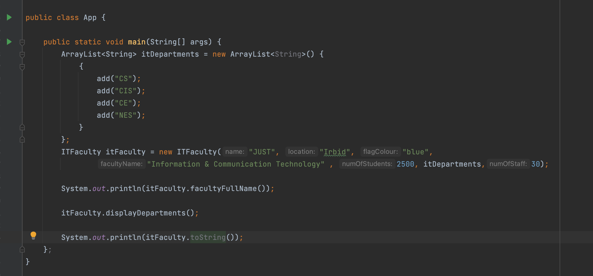

# Object Oriented Programming

### Java is a class-based object-oriented programming (OOP) language built around the concept of objects. OOP concepts are intended to improve code readability and reusability by defining how to structure your Java program efficiently. The core principles of object-oriented programming are:

1. Encapsulation
1. Inheritance
1. Abstraction
1. Polymorphism
1. Method Overriding
1. Method Overloading

<br/>


<br/>

## What is the structure of object-oriented programming?

The structure, or building blocks, of object-oriented programming include the following:

1. **Classes** are user-defined data types that act as the blueprint for individual objects, attributes and methods.

1. **Objects** are instances of a class created with specifically defined data. Objects can correspond to real-world objects or an abstract entity. When class is defined initially, the description is the only object that is defined.

1. **Methods** are functions that are defined inside a class that describe the behaviors of an object. Each method contained in class definitions starts with a reference to an instance object. Additionally, the subroutines contained in an object are called instance methods. Programmers use methods for reusability or keeping functionality encapsulated inside one object at a time.

1. **Attributes** are defined in the class template and represent the state of an object. Objects will have data stored in the attributes field. Class attributes belong to the class itself.


## What are Access Modifiers?

In Java, access modifiers are used to set the accessibility (visibility) of classes, interfaces, variables, methods, constructors, data members, and the setter methods

| Modifier  | Description                                                        |
| --------- | ------------------------------------------------------------------ |
| Default   | declarations are visible only within the package (package private) |
| Private   | declarations are visible within the class only                     |
| Protected | declarations are visible within the package or all subclasses      |
| Public    | declarations are visible everywhere                                |

## Object-oriented programming principles:

1. **Encapsulation** This principle states that all important information is contained inside an object and only select information is exposed. The implementation and state of each object are privately held inside a defined class. Other objects do not have access to this class or the authority to make changes. They are only able to call a list of public functions or methods. This characteristic of data hiding provides greater program security and avoids unintended data corruption.

1. **Abstraction** Objects only reveal internal mechanisms that are relevant for the use of other objects, hiding any unnecessary implementation code. The derived class can have its functionality extended. This concept can help developers more easily make additional changes or additions over time.

1. **Inheritance** Classes can reuse code from other classes. Relationships and subclasses between objects can be assigned, enabling developers to reuse common logic while still maintaining a unique hierarchy. This property of OOP forces a more thorough data analysis, reduces development time and ensures a higher level of accuracy.

1. **Polymorphism** Objects are designed to share behaviors and they can take on more than one form. The program will determine which meaning or usage is necessary for each execution of that object from a parent class, reducing the need to duplicate code. A child class is then created, which extends the functionality of the parent class. Polymorphism allows different types of objects to pass through the same interface.

1. **Method Overriding**

   **Method Overriding in Java :**
   If subclass (child class) has the same method as declared in the parent class, it is known as method overriding in Java.

   In other words, If a subclass provides the specific implementation of the method that has been declared by one of its parent class, it is known as method overriding.

   **Usage of Java Method Overriding :**

   1. Method overriding is used to provide the specific implementation of a method which is already provided by its superclass.

   1. Method overriding is used for runtime polymorphism

   **Rules for Java Method Overriding:**

   1. The method must have the same name as in the parent class
   1. The method must have the same parameter as in the parent class.
   1. There must be an IS-A relationship (inheritance).

```java
class Bank{

int getRateOfInterest(){return 0;}

}
//Creating child classes.
class SBI extends Bank{

int getRateOfInterest(){return 8;}

}

class ICICI extends Bank{

int getRateOfInterest(){return 7;}

}
class AXIS extends Bank{

int getRateOfInterest(){return 9;}

}
//Test class to create objects and call the methods
class Test2{
    public static void main(String args[]){
    SBI s=new SBI();
    ICICI i=new ICICI();
    AXIS a=new AXIS();
    System.out.println("SBI Rate of Interest: "+s.getRateOfInterest());
    System.out.println("ICICI Rate of Interest: "+i.getRateOfInterest());
    System.out.println("AXIS Rate of Interest: "+a.getRateOfInterest());
    }
}

```

6. **Method Overloading**

    **Method Overloading in Java :**
    If a class has multiple methods having same name but different in parameters, it is known as Method Overloading.

    **Advantage of method overloading:**

    Method overloading increases the readability of the program.

    **Different ways to overload the method**

    There are two ways to overload the method in java:

    1. By changing number of arguments

        ```java
        class Adder{  

        static int add(int a,int b){
            return a+b;
        }  

        static int add(int a,int b,int c){
            return a+b+c;
        }  

        }  
        class TestOverloading1{  

            public static void main(String[] args){  

            System.out.println(Adder.add(11,11));  
            System.out.println(Adder.add(11,11,11)); 
            
            }
        
        }  
        ```

    2. By changing the data type

        ```java
        class Adder{  

        static int add(int a,int b){
            return a+b;
        }  

        static double add(double a,double b){
            return a+b;
        }  

        }  
        class TestOverloading1{  

            public static void main(String[] args){  

            System.out.println(Adder.add(11,11));  
            System.out.println(Adder.add(12.3,12.6));  
            
            }
        
        }  
        ```


| No.  | Method Overloading| Method Overriding |
| ------------- | ------------- |------------- |
| 1) | Method overloading is used to increase the readability of the program.  | Method overriding is used to provide the specific implementation of the method that is already provided by its super class.|
| 2)  |  Method overloading is performed within class.	  | Method overriding occurs in two classes that have IS-A (inheritance) relationship.|
| 3)  |  	In case of method overloading, parameter must be different.	| In case of method overriding, parameter must be same.|
| 4)  | Method overloading is the example of compile time polymorphism.	| Method overriding is the example of run time polymorphism.|
| 5)  | In java, method overloading can't be performed by changing return type of the method only. Return type can be same or different in method overloading. But you must have to change the parameter.| 	Return type must be same or covariant in method overriding.|

## What are the benefits of OOP?

1. **Modularity** Encapsulation enables objects to be self-contained, making troubleshooting and collaborative development easier.

1. **Reusability** Code can be reused through inheritance, meaning a team does not have to write the same code multiple times.
1. **Productivity** Programmers can construct new programs quicker through the use of multiple libraries and reusable code.

1. **Easily upgradable and scalable** Programmers can implement system functionalities independently.

1. **Interface descriptions** Descriptions of external systems are simple, due to message passing techniques that are used for objects communication.

1. **Security** Using encapsulation and abstraction, complex code is hidden, software maintenance is easier and internet protocols are protected.

1. **Flexibility** Polymorphism enables a single function to adapt to the class it is placed in. Different objects can also pass through the same interface.


# Practice

- create a class University that has 3 private properties ( "name", "Location", "flag Color")
- setter and getter  methods for each property
- add toString method
- add an abstract method that prints the departments called `displayDepartments`
- create sub-Class Faculty of IT that has 3 private properties ("fullName","numOfStudents", "department", "numOfStaff") 
- create sub-Class Faculty of Engineering that has 3 private properties ("fullName", numOfStudents", "departments", "numOfStaff") 
- **Note** the departments property it's an ArrayList.
- setter and getter  methods for each property in the subclasses
- add the toString method for subclasses
- add `displayDepartments` method implementation
- add `facultyFullName` method that displays the Faculty name with the University name for each subclass

- test the 2 Faculties and check the output

### Files


### Main method



### Output


